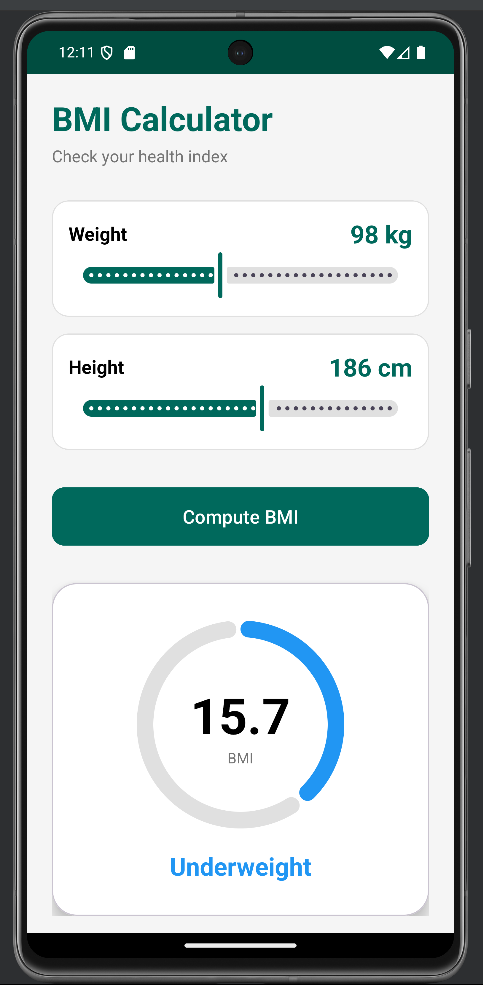

# BMI Calculator Project Report

**Date**: 2026-01-12
**Project**: Android BMI Calculator

## 1. App Design and Layout

The application has been designed with a focus on **modern Material Design 3** aesthetics, prioritizing usability, accessibility, and visual feedback.

### User Interface (UI) Philosophy
*   **Theme**: A health-centric color palette was chosen.
    *   **Primary Color**: **Deep Teal** (`#00695C`) conveys professionalism, calm, and medical reliability.
    *   **Action Elements**: Buttons and highlights use the primary color to guide user interaction.
    *   **Background**: A soft off-white (`#F5F5F5`) background ensures high contrast and readability.

### Layout Components
The main activity Layout (`activity_main.xml`) is built using a `ScrollView` and `ConstraintLayout` to ensure responsiveness across different device sizes.

1.  **Header**: The top section features a bold Title ("BMI Calculator") and a subtitle to clearly state the app's purpose.
2.  **Input Fields**: We utilize `TextInputLayout` with the `OutlinedBox` style.
    *   We provide two distinct fields for **Weight (kg)** and **Height (m)**.
    *   This component provides built-in accessibility (hints move to top) and error display states.
3.  **Calculate Button**: A prominent, full-width `MaterialButton` with rounded corners triggers the computation.
4.  **Result Card**: A `MaterialCardView` is used to display the results.
    *   It remains invisible until a calculation is performed.
    *   It centrally displays the numeric BMI value in a large font size (48sp) for immediate readability.
    *   It displays the **Category** text, which dynamically changes color based on the health classification.

## 2. Logic for BMI Calculation

The core logic resides in `MainActivity.java` and follows the standard Body Mass Index formula.

### The Algorithm
$$BMI = \frac{Weight (kg)}{Height (m)^2}$$

### Implementation Steps
1.  **Input Parsing**: The app retrieves strings from the input fields and parses them into `float` values.
    *   *Error Handling*: It includes a `try-catch` block to handle non-numeric inputs and prevent crashes.
    *   *Validation*: It explicitly checks for empty fields and ensures logic handles potential division by zero (height <= 0).
2.  **Calculation**: The formula is applied: `result = weight / (height * height)`.
3.  **Classification**: The result is compared against standard BMI ranges to assign a category and a color code for visual feedback.

| BMI Range | Category | Color Feedback |
| :--- | :--- | :--- |
| **< 18.5** | Underweight | **Blue** (#2196F3) |
| **18.5 – 25** | Normal | **Green** (#4CAF50) |
| **25 – 30** | Overweight | **Orange** (#FF9800) |
| **≥ 30** | Obese | **Red** (#F44336) |

